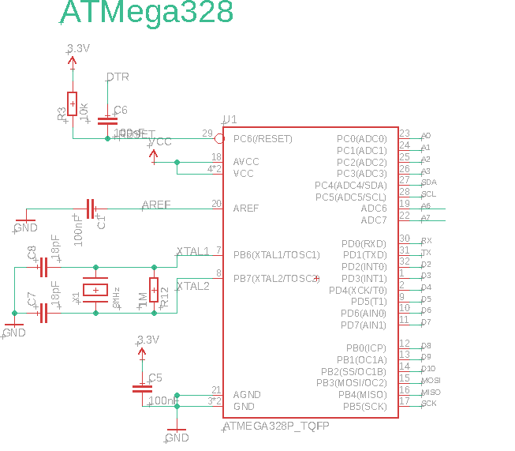

# gas-sensor

The goal is to create a box allowing the determination of the gas composition of a bioreactor. The sensor that will be available are: CO2 (MH-Z19), H2 (MQ-8) and methane (MQ-4) as well as temperature (DS18B20) and humidity (DHT-22).

The board will be compatible with arduino Lilapad Pro using a dedicated PCB.

Very interesting information:

- http://www.figarosensor.com/products/common(1104).pdf

Need to compensate for humidity and temperature ???

- https://forum.arduino.cc/index.php?topic=433045.0

## Sensors

| name_pin | function    | model   |                             |
| -------- | ----------- | ------- | --------------------------- |
| sensor1  | CH4         | MQ-4    |                             |
| sensor2  | H2          | MQ-8    |                             |
| sensor3  | CO2         | MH-Z19  | 3.3v (for RX / TX) + 5v!!!! |
| TEMP     | temperature | DS18B20 |                             |
| HUM      | humidity    | DHT-22  |                             |

Gaz sensor: http://www.china-total.com/Product/meter/gas-sensor/Gas-sensor.htm

Gaz sensor on sparkfun:
https://www.sparkfun.com/products/8891
https://www.sparkfun.com/products/9404

Gaz sensor on mysensors: https://www.mysensors.org/build/gas

Drying the air / pumping
Particulate or Coalescing Filters
http://www.pneumaticplus.com/pneumaticplus-saf4000-series-particulate-air-filter-1-2-npt-with-bracket/
https://www.aliexpress.com/item/15L-M-12V-dc-electric-diaphragm-brush-small-air-compressor-pump/1790013118.html

Fans

https://www.pelonistechnologies.com/micro-fans

Pneumatic
https://www.alibaba.com/product-detail/A102-China-sup

## Pinout

| port | pin      |                       |     |
| ---- | -------- | --------------------- | --- |
| PC0  | A0       | LCD3                  |     |
| PC1  | A1       | LCD4                  |     |
| PC2  | A2       | Sensor1               |     |
| PC3  | A3       | HUMIDITY              |     |
| PC4  | SDA      | Slave I2C             |     |
| PC5  | SCL      | Slave I2C             |     |
| PC6  | A6       | Sensor2               |     |
| PC7  | A7       | Sensor3               |     |
| PD0  | RX       | FTDI                  |     |
| PD1  | TX       | FTDI                  |     |
| PD2  | D2       | Soft RX - MH-Z19      |     |
| PD3  | D3       | Sensor2 on            | PWM |
| PD4  | D4       | Soft TX - MH-Z19      |     |
| PD5  | D5       | Sensor3 on            | PWM |
| PD6  | D6       | Onewire (temperature) | PWM |
| PD7  | D7       | LCD1                  |     |
| PB0  | D8       | LCD2                  |     |
| PB1  | D9       | Sensor1 on            | PWM |
| PB2  | D10      |                       | PWM |
| PB3  | MOSI D11 | LCD5                  | PWM |
| PB4  | MISO D12 | LCD6                  |     |
| PB5  | SCK D13  | LCD7 (background)     |     |

Attenion: footprint of MH-Z19 should be directly on baord

## Power supply

- plug for 5V
- MCP1703-33 for µC power supply

## Schematic

## Inspiration for PCB

- Resistor + Capacitor: 0805
- Crystal 8MHz: Footprint 6035

* https://github.com/Hackuarium/esp-12e/tree/master/kicad

  - ICSP - TAG connect - take care of pin mapping !
  - RJ12 - 6P6C
  - FTDI232
  - LCD: WC1602A

## Get inspired from scale board

* https://github.com/Hackuarium/beemos/tree/master/scale-i2c/eagle 
* https://github.com/Hackuarium/esp-12e/tree/master/kicad/libs
